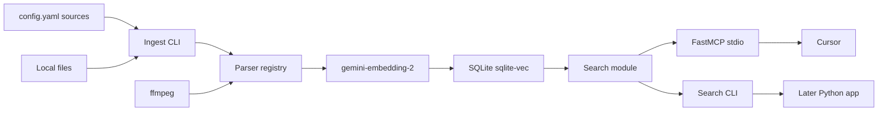

# Gemini multimodal file search roadmap

Greenfield Python project. Index local files with **gemini-embedding-2**, store vectors under **`%USERPROFILE%\nl-file-search\`**, and search from Cursor via MCP. A later Python app can import the same search module.

**Security:** Never commit a Gemini API key, `.env`, or the SQLite index. Put `GEMINI_API_KEY` only in `%USERPROFILE%\nl-file-search\.env` (outside the repo). If a key was ever pasted into chat, revoke it and create a new one.

## Decisions

- **Language:** Python 3.12+, package `nl_file_search`, official `google-genai` client
- **Embeddings:** `gemini-embedding-2`, **768** dimensions (can raise to 1536/3072 later without a new product)
- **Store:** SQLite + `sqlite-vec` at `%USERPROFILE%\nl-file-search\index.sqlite`
- **Config:** `%USERPROFILE%\nl-file-search\config.yaml` — list of source folders and excludes
- **Secrets:** `%USERPROFILE%\nl-file-search\.env` — `GEMINI_API_KEY` only
- **Cursor:** FastMCP stdio (`search_files`, `get_file`); configure MCP in Cursor settings (see README)
- **Parsers:** registry from day one so Phase 2/3 are new modules, not a rewrite
- **Network:** ingest and search both call Gemini (query embedding). No offline search.

## Architecture



**Ingest:** walk configured roots → skip excludes / secrets / unchanged SHA-256 hashes → parser emits one or more chunks (text and/or media bytes) → embed → upsert.

**Query:** embed the natural-language string with the same model and prefixes → `sqlite-vec` KNN → return path, score, modality, snippet or media note.

**Text prefixes (text chunks only, not images/video/PDF-as-bytes):**

- Query: `task: search result | query: {query}`
- Document: `title: {title} | text: {content}` (`title: none` if missing)

Wrap each Gemini item as `types.Content` so one request does not collapse into a single aggregated embedding.

## Data and config (user profile, not the repo)

```
%USERPROFILE%\nl-file-search\
  config.yaml
  .env                 # GEMINI_API_KEY — never copy into the repo
  index.sqlite
  logs\
```

Example `config.yaml`:

```yaml
sources:
  - path: "D:\\Notes"
  - path: "C:\\Users\\you\\Pictures"
exclude:
  - "**/.git/**"
  - "**/node_modules/**"
  - "**/.env"
  - "**/*credential*"
  - "**/*.pem"
embed:
  model: gemini-embedding-2
  dimensions: 768
video:
  max_seconds: 120
```

Default excludes always include `.git`, `node_modules`, `.venv`, `__pycache__`, and secret-like names (`.env`, `*.pem`, `id_rsa`, `credentials.json`). Unknown extensions are skipped (not parsed).

## Schema (stable across phases)

- **files:** `path`, `sha256`, `mtime`, `size`, `mime`, `parser`, last ingest status
- **chunks:** `id`, `file_id`, `chunk_index`, `modality` (`text` | `image` | `video` | `pdf` | later `office` | `audio`), `text` (nullable), `title`, `heading`, time/page range, `vector` via `sqlite-vec`

Re-ingest skips unchanged hashes. Deleted files are removed from the index on a later scan.

## Phase 1 (current)

**In scope:** `.md`, `.txt`; images; videos; PDFs. Multiple configured folders. ffmpeg required when videos are present.

| Type | How we index | Limits / tools |
| --- | --- | --- |
| `.md`, `.txt` | Extract text, heading/paragraph chunks | ~8,192 tokens per embed; split long files |
| Images | Send bytes to Gemini | Native PNG/JPEG. Convert WEBP/BMP/GIF to JPEG with Pillow. Skip HEIC |
| Video `.mp4`, `.mov` | ffmpeg split into **120s** segments; embed each clip | Gemini: ~120s, MP4/MOV. Other containers: skip with a log |
| PDF | Split pages (**1 page per embed**) | `pypdf`; send `application/pdf` bytes |

**CLI**

- `nl-search ingest` — scan all `sources`
- `nl-search ingest --path C:\foo` — one-off root
- `nl-search search "vintage red truck in the rain"`
- `nl-search status` — counts by modality, last error

**MCP:** `search_files(query, k, modality?)`, `get_file(path)` (text/snippet; for media return path + chunk time/page, do not dump binary into chat).

**Phase 1 out of scope:** Office, audio/music, source-code-aware chunking, a GUI.

## Phase 2 — modern Office

New parsers only. Same store, MCP, and config.

- `.docx`, `.xlsx`, `.pptx` via MarkItDown (or `python-docx` / `openpyxl` / `python-pptx`) → markdown/text chunks → embed as text
- Optional embedded images from Office → reuse the image parser
- Optional extra: `nl-search[office]` so Phase 1 installs stay thin
- Legacy `.doc`, `.xls`, `.ppt` are out of scope (skipped like any unknown type)

## Phase 3 — music

**Music:** `.mp3`, `.m4a`, `.flac`

- Gemini audio is **MP3/WAV, 180s**. ffmpeg converts m4a/flac → wav/mp3 and splits tracks into **180s** chunks (same pattern as Phase 1 video)
- Optional extra: `nl-search[audio]`

## What we will not do

- Google Docs, Google Drive export, or LibreOffice / legacy Office (`.doc`, `.xls`, `.ppt`)
- Commit API keys, `.env`, or the SQLite index
- Send `.env`, keys, or credential files to Gemini
- Buy document plugins; modern Office uses open-source parsers
- MiniLM / Hugging Face from [vector_db_mcp_cursor.md](vector_db_mcp_cursor.md) — superseded except for MCP/CLI shape
