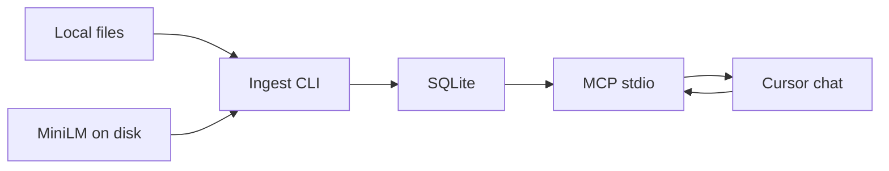

# Local vector database searchable from Cursor (home, from zero)

Build this on the **home computer only**. Clean machine, no VPN, full access to PyPI and Hugging Face. Start from zero — do not assume any packages, models, or repo state from elsewhere.

**Goal:** Index local files (documents + code) into an on-disk database of embeddings and metadata. Search it from Cursor chat via a local MCP server.

Keyword-only search is out of scope. This is neural embeddings.

---

## Decisions

- **Language:** Python 3.12+
- **Embeddings:** `sentence-transformers/all-MiniLM-L6-v2` (384-d, ~90 MB). Load from a project folder after the first download so later runs can be offline.
- **Store:** SQLite `data/kb.sqlite` + cosine search with `numpy`. No separate database server.
- **Cursor:** MCP over stdio (`search_kb`, `get_file` / `get_chunk`), plus a CLI for ingest and debug.
- **v1 files:** `.md`, `.txt`, source code. PDF/docx later.
- **After setup, network:** only Cursor (chat). Ingest, embed, store, and search stay on the home machine.

---

## Architecture



**Schema:** `id`, `vector` (384-d blob), `text`, `path`, `mtime`, `file_type`, `language`, `title`, `heading`

**Chunking:** docs by heading/paragraph; code by language-aware line windows with overlap. Filter on `file_type` (`doc` vs `code`).

---

## From-zero setup (home)

Use a venv in the project so it is isolated.

```powershell
cd <project-root>
python -m venv .venv
.\.venv\Scripts\Activate.ps1
python -m pip install -U pip
python -m pip install sentence-transformers numpy fastmcp
```

`sentence-transformers` pulls `torch`, `transformers`, `safetensors`, and related deps. That is the full package set.

Download the model into the repo (one time):

```powershell
huggingface-cli download sentence-transformers/all-MiniLM-L6-v2 --local-dir models/all-MiniLM-L6-v2
```

Verify:

```powershell
python -c "from sentence_transformers import SentenceTransformer; SentenceTransformer(r'models/all-MiniLM-L6-v2'); print('ok')"
```

Success is `ok`. The folder should include `model.safetensors` (~90 MB), `config.json`, tokenizer files, `modules.json`, and `sentence_bert_config.json`.

Optional later (offline load):

```powershell
$env:HF_HUB_OFFLINE = "1"
$env:TRANSFORMERS_OFFLINE = "1"
python -c "from sentence_transformers import SentenceTransformer; SentenceTransformer(r'models/all-MiniLM-L6-v2'); print('ok-offline')"
```

On bash/macOS/Linux the same steps apply (`source .venv/bin/activate`, `$env:` → `export`).

---

## What to build

- `src/embed.py` — load MiniLM from `models/all-MiniLM-L6-v2`
- `src/store.py` — SQLite create/upsert
- `src/ingest.py` — scan, parse, chunk, embed, upsert
- `src/search.py` — cosine + metadata filters (CLI + MCP)
- `src/mcp_server.py` — FastMCP stdio
- `.cursor/mcp.json` — point Cursor at the venv + `mcp_server.py`
- Cursor rule — when the question is about the local KB, call `search_kb` first
- `data/` and `models/` gitignored (or gitignore `data/` and keep a README under `models/`)

**Example questions after it works:** “What did I write about X?” / “Find Python helpers related to auth” / “Open the source of the top hit.”

**Limits:** Re-ingest when files change. MiniLM is a small local model. Retrieved chunks sent in chat go to Cursor like any open file. PDF/Office later.

Do not implement until you are on the home machine and ask to build.
